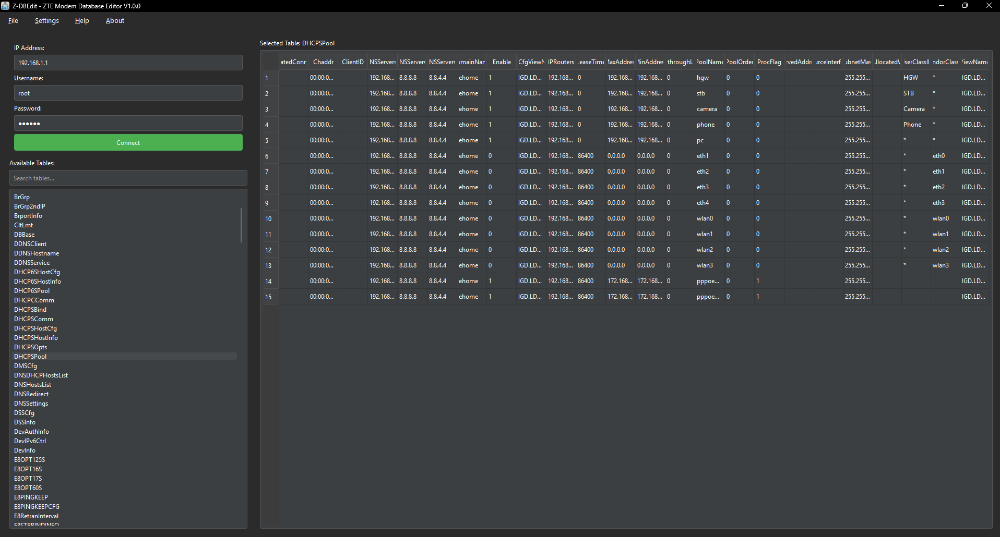
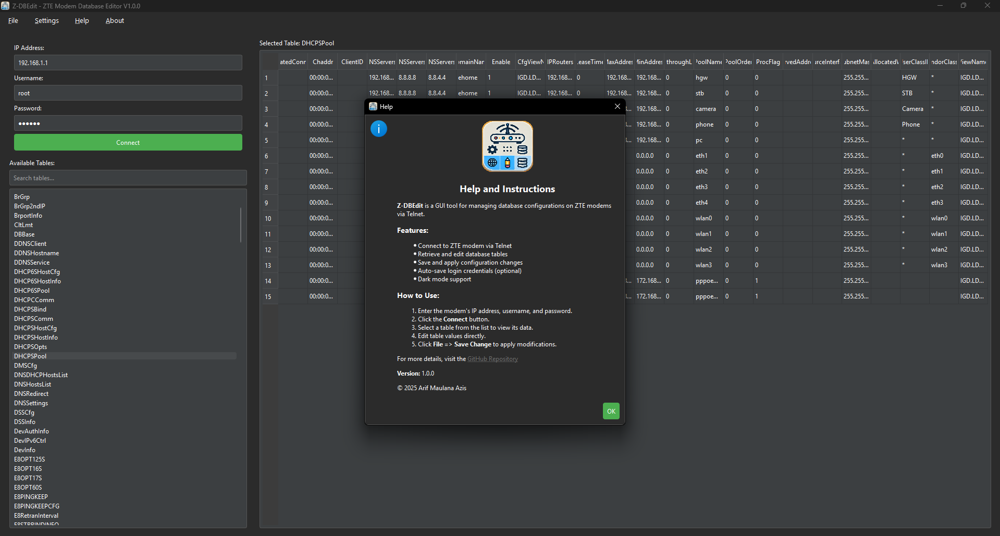

<h1 align="center">Z-DBEdit - ZTE Modem Database Editor</h1>

<p align="center">
  
</p>

## Description
Z-DBEdit - ZTE Modem Database Editor is GUI tool for editing ZTE modem databases via Telnet  

## Key Features
- Connect to ZTE modem via Telnet  
- View and edit modem database tables  
- Auto-complete table search  
- Dark/light theme support  
- Save/load connection configuration  
- Direct table value editing  
- Data change history  
- Progress bar for long operations  

## Requirements
- Python 3.6+  
- PySide6  
- Telnetlib (built-in)  

## Installation  
### Option 1: Download Precompiled Windows Version  
Download the latest precompiled Windows executable from the [latest release](https://github.com/Arifmaulanaazis/Z-DBEdit/releases/latest).  

### Option 2: Install via Source Code  
1. Clone this repository:  
   ```bash
   git clone https://github.com/Arifmaulanaazis/Z-DBEdit.git
   ```
2. Install dependencies:  
   ```bash
   pip install pyside6
   ```

## Usage  
1. **Run the application:**  
   - If using the precompiled version, simply double-click the `.exe` file.  
   - If running from source:  
     ```bash
     python main.py
     ```
2. **Enter modem details:**  
   - IP Address (default: 192.168.1.1)  
   - Username (default: root)  
   - Password (default: Zte521)  
3. **Click "Connect"**  
4. **Select a table from the list on the left**  
5. **Edit values directly in the table**  
6. **Save changes via File > Save Change menu**  

## Main Menu  
- **File**:  
  - Load/Save connection config  
  - Save changes to modem  
  - Exit  

- **Settings**:  
  - Auto-save credentials  
  - Change theme (dark/light)  

- **Help**:  
  - User guide  
  - About the application  

## Troubleshooting  
**Connection failed:**  
- Ensure the modem supports Telnet  
- Check firewall/antivirus settings  
- Try resetting the modem  

**Changes not saved:**  
- Ensure you click "Save Change" after editing  
- Check for a stable connection  
- Verify that the edited table is writable

## Screenshot App
<p align="center">
  
</p>

<p align="center">
  
</p>

## Contribution  
Report issues or submit pull requests via GitHub:  
[https://github.com/Arifmaulanaazis/Z-DBEdit](https://github.com/Arifmaulanaazis/Z-DBEdit)  

## License  
MIT License © 2025 Arif Maulana Azis
